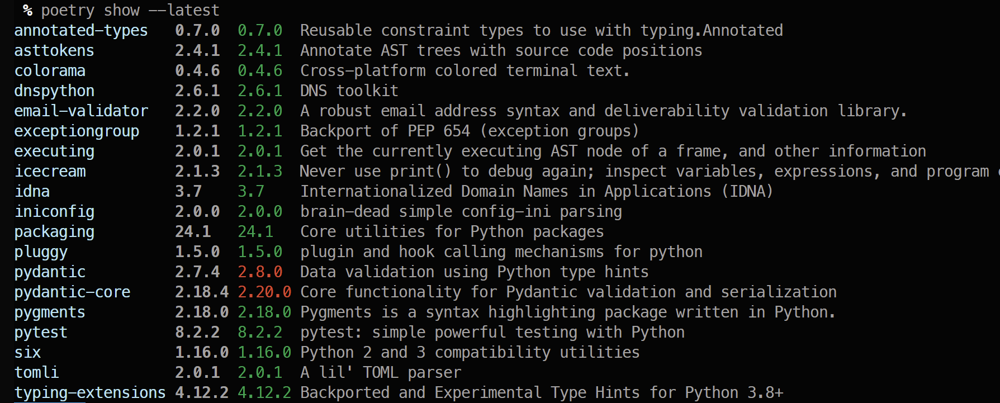
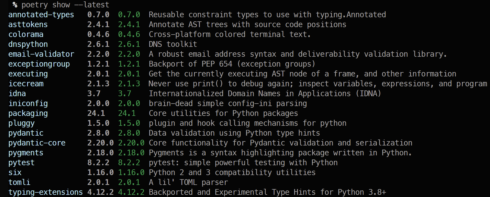

# Poetry
## poetry-installation
https://python-poetry.org/docs/#installation

    curl -sSL https://install.python-poetry.org | python3 - --version 1.6.1

>
Retrieving Poetry metadata

Welcome to Poetry!

This will download and install the latest version of Poetry,
a dependency and package manager for Python.

It will add the `poetry` command to Poetry's bin directory, located at:

/home/kov/.local/bin

You can uninstall at any time by executing this script with the --uninstall option,
and these changes will be reverted.

Installing Poetry (1.6.1): Installing Poetry*
>

    poetry --version
>
    poetry completions bash >> ~/.bash_completion
>
    poetry env list

## Basic usage - poetry

To setup a new project

    poetry new pydantic-service

For an existing project

    poetry init

To add new dependencies

    poetry add pytest
    poetry add icecream
    poetry add 'pydantic[email]'

To install all dependencies from lock file

    poetry install

To see all packages

    poetry show --latest

To update dependencies

    poetry lock -vvv

## poetry config
Listing the current configuration

    poetry config --list

Updating config setting

    poetry config virtualenvs.options.system-site.packages true

Remove specific setting

    poetry config virtualenvs.path --unset
